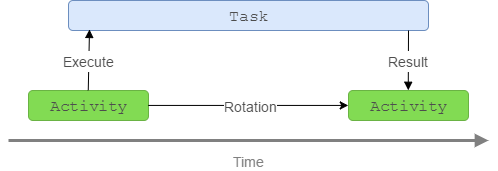

# Android-Retainable-Tasks
[  ](https://bintray.com/rolf-smit/maven/android-retainable-tasks/_latestVersion)
[](http://android-arsenal.com/details/1/3236)

**Android-Retainable-Tasks is an easy to use mini-library that makes it really easy to retain background tasks.** Executing something in the background while maintaining the UI can be quite challenging, especially when Android recreates your Activity on rotation. This library tries to solve this problem by making sure your background task is attached to the (new) UI when needed. The implementation of this library is based on the `AsyncTask` source from Android O and uses the same patterns as used in the new [Android Architecture Lifecycle](https://developer.android.com/reference/android/arch/lifecycle/Lifecycle.html) library to retain tasks. 



*Key features:*

 - Light weight & Simple API
 - Annotation support
 - Same Task API on all Android versions, based on the Android O `AsyncTask` implementation
 - Supports the [LifecycleObserver](https://developer.android.com/reference/android/arch/lifecycle/LifecycleObserver.html) class from the [Android Architecture Lifecycle](https://developer.android.com/reference/android/arch/lifecycle/Lifecycle.html) library;
 - Supports API 14+ <sub>(with or without the Android support libraries)</sub>

## Sample
Simple, no need to retain stuff yourself, just implement the methods/annotations you need and you're
all set.

```java
public class Main extends TaskActivityCompat {
    
    @Override
    public void onClick(View view){
        if (!getTaskManager().isActive("task-id")) {
            getTaskManager().execute(new ExampleTask("task-id"));
        }
    }
    
    // Now this is cool, we can have a single method handle both calls,
    // also note how this method will still be called in the new
    // Activity instance after after rotation.
    @TaskPostExecute("task-id")
    @TaskCancel("task-id")
    public void onFinish(ExampleTask task){
        if(task.isCancelled()) {
            // Do something
        } else {
            // Do something else
        }
    }
}
```

>In this example only `@TaskPostExecute` and `@TaskCancel` are demonstrated but you might also
 want to use `@TaskAttach` or `@TaskProgress`. For more samples and usage see the [expanded documentation](DOCUMENTATION.md).

## Download

Android-Retainable-Tasks is available on jcenter just like many other Android/Java packages, just add the following compile dependencies to your modules `build.gradle` file.

```groovy
dependencies {
    // The library dependency
    compile 'org.neotech.library:android-retainable-tasks:1.0.0-rc-2'
    
    // Needed if you want to use annotations
    annotationProcessor 'org.neotech.library:android-retainable-tasks-compiler:1.0.0-rc-2'
}
```

Because of the dependency on Google's new Architecture Lifecyle library you must add Google's maven repository to your top-level build.gradle file (if you did not already do this).
```groovy
allprojects {
    repositories {
        maven { url 'https://maven.google.com' }
    }
}
```

## Why and when

*When and why should I use this library?* Always! its awesome! No, obviously you should not always use this library. **This library is useful when you need to do things in the **background** which are heavily bound to the user-interface** like: Refreshing a list which is populated from a database, loading an article from a network source or decoding an image, all those things are quit tightly bound to the user-interface and when the device rotates you don't want to cancel this work or do it again. If you need: task scheduling, automatic retries, task persistence across reboots, task constrains etc. then you need to use an additional library.

## Migration from version 0.x to 1.x

If you are using Android-Retainable-Tasks version 0.x and you wan't to upgrade to version 1.x most things should just work fine, but 100% compatibility cannot be guaranteed, consider the following changes:

* **Fragments no longer need tags in order for them to support a `TaskManager`**  
Prior to version 1.x Fragments (`TaskFragment` or `TaskFragmentCompat`) needed to have a tag in order for them to support a `TaskManager` instance through the `getTaskManager()` method. In version 1.x this is no longer necessary. This is however still necessary when you are not using the Android Support library, because of some important APIs that are missing from the legacy `Fragment` implementation.
* **The `TaskManagerProvider` has been renamed to `TaskManagerOwner`**
The `TaskManagerProvider` has been renamed to `TaskManagerOwner` so it's more inline with the naming used in the Android Architecture Lifecycle library, the old name can still be used but it's deprecated and will probably be removed in later versions.
* **The `Task.getLastKnownProgress()` method no longer throws an `IllegalStateException`**
The `Task.getLastKnownProgress()` method returns null in version 1.x instead of throwing an  `IllegalStateException` when no progress is available yet, when upgrading check if no code relies
on this behaviour!
* **When using the `TaskManagerLifeCycleProxy` you now also need to call `onDestory()`**
In version 1.x `onDestroy()` has been added to the `TaskManagerLifeCycleProxy` class, classes using
 the `TaskManagerLifeCycleProxy` need to call this method. Adjust your code accordingly, because not doing so can lead to temporary memory leaks.

## Contribute

*“As long as I am breathing, in my eyes, I am just beginning.”*

Pull-requests are always welcome, if you are not sure about adding or modifying something specific create and issue and discuss it with me, I'm open for ideas!

To-do list:

 - [ ] Add support for RXJava observables, so that this library can optionally be used to retain those observables.
 - [ ] Finish documentation;
 - [ ] Get a fancy logo;
 - [ ] Write some real tests for the library besides having only a demo app;